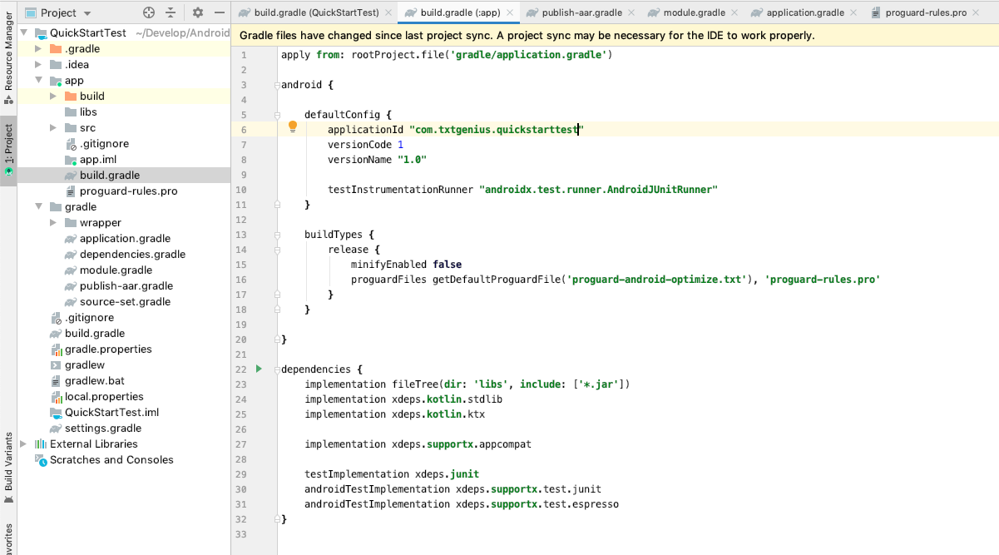

# Quick Start

快速创建规范的Android工程。

* 使用 `dependencies.gradle` 管理所有依赖。
* 使用 `application.gradle` 和 `module.gradle`
  存放app及library模块公用配置。
* 存放常用混淆规则。
* 集成Maven上传脚本，使用灵活。

## 1. 为什么需要QuickStart
* 当项目里存在多个模块时，是否出现依赖版本冲突？
* 当提取公共配置，新建项目时，又要一个一个复制？
* 模块中添加某个依赖时，经常全局搜索，然后复制粘贴？

那就试试这个脚本吧，新建工程时，只需一行指令，就可以得到以下工程配置：

干净的项目级别 `build.gradle`:


干净的app `build.gradle`:



统一管理的依赖:


## 2. 如何使用

### 2.1 一键初始化工程
打开Terminal，进入 QuickStart 目录，执行 `install.sh` 一键安装：
```
$ ./install.sh <PROJECT_DIRECTORY>
Install gradle complete...
Install project build.gradle complete...
Install app build.gradle complete...
Install app proguard rules complete...
```
* PROJECT_DIRECTORY 为新建的 Android 工程的绝对路径。

将会部署以下内容：
1.  所有gradle脚本部署至 `PROJECT_DIRECTORY/gradle` 目录下。
2.  部署全新项目级别 `build.gradle`。
3.  部署app模块 `build.gradle` 以及 `proguard-rules.pro`。

**注意：**
1. 部署好后，需要在app模块配置 `applicationId`，即应用包名。

### 2.2 一键初始化库模块
打开Terminal，进去 QuickStart 目录，执行 `install-module.sh` 一键安装：
```
$ ./install-module.sh <MODULE_DIRECTORY>
Install complete...
```
* MODULE_DIRECTORY 为对应 Android module 的绝对路径。

将会部署以下内容：
1. 部署全新library模块 `build.gradle`。

### 2.3 使用Maven上传脚本
在library模块 `build.gradle` 添加以下内容：
```
ext {
    GROUP_ID = 'com.txtgenius'
    ARTIFACT_ID = 'token-refresher'
}

apply from: rootProject.file('gradle/publish-aar.gradle')
```

在项目 `gradle.properties` 中，添加以下属性：
```
# Maven release 仓库
MAVEN_URL_RELEASE=http://localhost:8081/repository/maven-releases/
# Maven snapshot 仓库
MAVEN_URL_SNAPSHOT=http://localhost:8081/repository/maven-snapshots/
# Maven 登陆用户名
MAVEN_USER_NAME=admin
# Maven 登陆密码
MAVEN_PASSWORD=123456
```

在
【Gradle】窗口，启动【PROJECT_NAME】->【LIBRARY_NAME】->【Tasks】->【publishing】->【publish】


## 4. Demo
参考[Demo](demo)